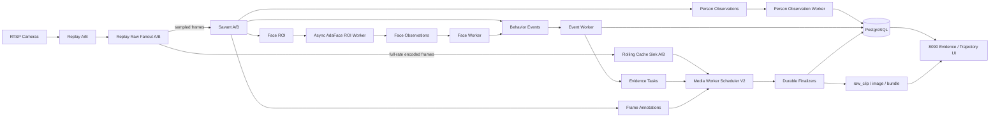
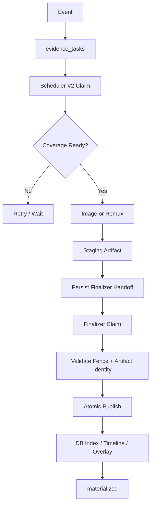

# Video Analytics Platform

面向多路 RTSP 视频的实时分析、人员/人脸检索与证据固化平台。核心技术栈包括 Savant、NVIDIA DeepStream、TensorRT、Redis Streams 与 PostgreSQL。

> 当前 README 只描述主运行链和主要设计边界。详细实现、性能验证与历史实验见 `docs/`。

## 项目定位

这个项目解决的不是单路“检测 + 截图”，而是高并发视频场景下的完整闭环：

- 多路 RTSP 接入与动态编排；
- 人体 / Pose / Face 推理与行为规则；
- 人脸 ROI 异步 AdaFace embedding；
- 人体轨迹、人员图库和 watchlist 匹配；
- 事件、告警和证据任务；
- rolling-cache 驱动的事件录像与图片固化；
- DB-backed timeline / overlay / evidence viewer；
- 单卡多分支部署与压力验证。

## 快速启动

```bash
bash scripts/midterm_start.sh
```

默认操作入口：

```text
http://127.0.0.1:8090/operator
```

推荐通过 8090 操作台管理摄像头、ROI、算法与运行预设，不建议手工逐容器启动完整链路。

## 系统架构



### 架构原则

1. **分析流和证据流分离**：Savant 只消费采样帧做 AI，rolling-cache 保留完整编码视频窗口，避免事件录像依赖分析 FPS。
2. **推理和业务状态分离**：GPU 推理负责产生 observation，事件策略、轨迹持久化、图库匹配由独立 worker 消费 Redis Streams。
3. **Redis 是消息总线，不是最终事实源**：配置、事件、任务与 evidence metadata 由 PostgreSQL 持久化。
4. **证据固化采用 durable handoff**：媒体准备完成后先把 finalizer 身份信息持久化到 DB，再交给 finalizer，避免进程崩溃时丢失任务归属。
5. **完整预设优先 rolling-cache**：高密度运行下不会为每个事件回放一次 Replay job。

## 推理链路

完整双分支预设下，推理链主要分为两段。

### 1. Savant / DeepStream 主推理

```text
sampled frame
  -> detector / pose
  -> tracker
  -> behavior rules
  -> face detector
  -> ROI export
  -> person / event / annotation streams
```

Savant 负责高吞吐视频推理和帧级对象语义，不负责人员图库查询和 evidence 物化。

### 2. AdaFace 异步推理

```text
security.face_rois
  -> adaface-roi-worker
  -> TensorRT batch inference
  -> security.face_observations
  -> face-worker
  -> pgvector/Qdrant match
  -> watchlist event
```

完整预设会关闭 Savant 内嵌 AdaFace 输出，并将 embedding 统一交给 ROI worker，避免重复推理。ROI worker 使用 Redis consumer group、批处理与 stale reclaim，消息在 observation 成功发布后才 ACK，因此整体语义保持 at-least-once，下游持久化必须保持幂等。

## 证据固化链路



当前生命周期核心由 `libs/evidence_lifecycle/contract.py` 与 `services/media-worker/app/materialization_repository.py` 管理。

主要安全机制：

- lease owner / token / generation fencing；
- worker 崩溃后的租约恢复；
- staging 与 canonical path 分离；
- finalizer handoff 先落 PostgreSQL，再进入 finalizer 阶段；
- handoff 携带 attempt token、source、runtime epoch、窗口、segment IDs、size、mtime 等身份信息；
- terminal / retryable reason 分离；
- 原子发布后再更新最终 materialized 状态。

这套设计偏复杂，但对于多进程、高并发和 worker restart 场景是合理的。更值得继续优化的是代码职责拆分和可观测性，而不是把生命周期重新简化成“事件 -> ffmpeg -> 完成”。

## 运行预设

| 预设 | 目标 | 主要参数 |
| --- | --- | --- |
| `production_t4_40` | 单 T4，40 路，A/B 20/20 | 4 FPS，Pose/Face batch 4，ROI AdaFace 16，CUDA MPS，rolling 600s |
| `local_4090_60` | 单 4090，60 路，A/B 30/30 | 8 FPS，Pose/Face batch 4，ROI AdaFace 16，rolling 600s |

权威参数定义在：

```text
services/api/app/services/runtime_topology.py::RUNTIME_PROFILE_PRESETS
```

## 主要目录

```text
videoanalysis/
├── services/
│   ├── api/                       # FastAPI 与运行时编排
│   ├── adaface-roi-worker/        # 异步 AdaFace TensorRT worker
│   ├── face-worker/               # 人脸匹配 / watchlist
│   ├── event-worker/              # 事件与 evidence task
│   ├── person-observation-worker/ # 轨迹持久化
│   └── media-worker/              # rolling evidence / Scheduler V2 / finalizer
├── modules/
│   └── savant_security/           # Savant / DeepStream 推理模块
├── libs/
│   └── evidence_lifecycle/        # evidence canonical lifecycle contract
├── infra/                         # Docker Compose / env / runtime overrides
├── db/                            # PostgreSQL schema / migrations
├── harness/                       # 单元、合同、集成、压力测试
├── scripts/                       # 启动、验证、分析工具
├── specs/                         # 规格设计
└── docs/                          # 架构、部署、性能和历史记录
```

## 当前代码质量重点

项目已经具备较完整的功能边界和测试，但还有明显的维护性债务：

- `services/media-worker/app/worker.py` 仍然过大，承载了过多 orchestration 逻辑；
- `runtime_topology.py` 同时包含预设、环境生成、Docker 编排和状态流程，后续适合继续拆成 profile / planner / executor；
- evidence lifecycle 本身不建议大改，应该优先减少 worker 层的重复状态转换代码；
- GPU 推理链应继续保持“主视频推理 + 异步人脸 embedding”结构，而不是重新合并成单个巨型 pipeline。

## 验证

项目测试主要位于：

```text
harness/tests/
```

与证据固化最相关的测试包括：

```text
harness/tests/test_evidence_lifecycle_contract.py
harness/tests/test_materialization_repository_contract.py
harness/tests/test_media_worker_finalizer_boundary.py
harness/tests/test_media_worker_finalizer_integration.py
harness/tests/test_media_worker_scheduler_v2.py
harness/tests/test_rolling_cache_materialization.py
```

推理和人脸链相关测试包括：

```text
harness/tests/test_face_roi_stream_contract.py
harness/tests/test_face_worker.py
harness/tests/test_face_vector_store.py
harness/tests/test_runtime_topology_service.py
```

## 文档

- 当前架构：`docs/current_architecture.md`
- 当前主线状态：`docs/current_mainline_status.md`
- 部署：`docs/midterm_deployment.md`
- 8090 操作指南：`docs/midterm_web_operator_guide.md`
- 前端/API：`docs/frontend_interface/README.md`

## 当前结论

从架构上看，这个项目最有价值的部分不是单个模型，而是三条链路已经基本解耦：

```text
视频推理链
事件 / 业务链
证据固化链
```

下一阶段的优化重点应该是继续缩小巨型 worker、明确模块接口和增强故障恢复测试，而不是重新设计已经具备 fencing、lease、durable handoff 的 evidence 核心。
