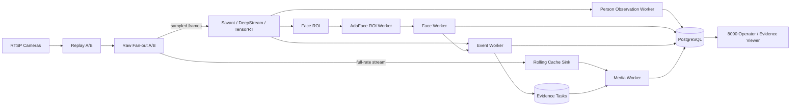

# Video Analytics Platform

面向多路 RTSP 摄像头的实时视频智能分析与事件证据平台。系统将视频采集、GPU 推理、行为事件、人脸识别、人员轨迹、滚动缓存与证据生成整合为一套可运行、可观测、可管理的服务化架构。

核心技术栈包括 **Savant / NVIDIA DeepStream / TensorRT、GStreamer、FastAPI、Redis 与 PostgreSQL**。

## 核心能力

- 多路 RTSP 摄像头接入、运行时分片与 A/B 双分析分支；
- 基于 GPU 的目标检测、姿态/行为规则与实时事件处理；
- Face ROI、AdaFace 特征提取、人员图库与 watchlist 匹配；
- 人员观测、跨时间轨迹查询与事件关联；
- 全帧率 rolling cache 与事件前后窗口证据生成；
- 原始视频片段、快照、时间线、检测框/姿态等证据元数据；
- 8090 Web 操作台，覆盖摄像头配置、运行控制、证据查看、人员管理与运行状态；
- 面向多摄像头场景的任务调度、source fairness、租约恢复与证据生命周期管理。

## 系统架构



完整运行预设采用 **rolling-cache-first** 的证据链：实时分析链路按配置帧率执行推理，同时保留全帧率编码流用于事件发生后的证据裁剪。事件、人员、规则和证据元数据由 PostgreSQL 持久化，Redis 主要承担异步消息与流式任务传递。

## 快速开始

### 1. 环境准备

目标运行环境为 Linux + Docker Compose + NVIDIA GPU Runtime。模型、存储目录和具体 GPU 配置请参考 [部署文档](docs/midterm_deployment.md)。

### 2. 启动服务

```bash
bash scripts/midterm_start.sh
```

启动完成后打开：

```text
http://127.0.0.1:8090/operator
```

日常使用无需直接访问内部 FastAPI 容器端口。

### 3. 配置并启动视频分析

1. 在 **配置 → 摄像头** 中登记 RTSP 地址；
2. 为摄像头配置 ROI、算法和事件规则；
3. 在 **启动与运行** 中选择摄像头；
4. 选择与硬件匹配的运行预设；
5. 启动完整链路并在运行页观察 source、FPS、队列和延迟；
6. 在 **证据** 与 **人员轨迹** 页面查看分析结果。

### 4. 健康检查与停止

```bash
bash scripts/midterm_health.sh
bash scripts/runtime/doctor_midterm.sh
bash scripts/midterm_stop.sh
```

## 运行预设

仓库提供两套主要的单 GPU 参考预设：

| 预设 | 目标规模 | 分析帧率 | 分支 | Rolling Cache |
| --- | ---: | ---: | --- | ---: |
| `production_t4_40` | 40 路 | 4 FPS | A/B 20/20 | 600 s |
| `local_4090_60` | 60 路 | 8 FPS | A/B 30/30 | 600 s |

精确参数由 `services/api/app/services/runtime_topology.py` 中的 `RUNTIME_PROFILE_PRESETS` 定义。上述规模是仓库提供的硬件配置模板，不代表任意码率、分辨率、事件密度和摄像头环境下都具有相同吞吐能力。

## 证据生成链路

```text
Event / Watchlist Match
        |
        v
  evidence_tasks (PostgreSQL)
        |
        v
 Media Worker Scheduler
        |
        +--> Rolling Cache segments
        +--> frame annotations / timeline
        |
        v
 raw clip / snapshot / metadata
        |
        v
 PostgreSQL index + 8090 viewer
```

证据任务具有明确的等待、执行、完成、失败和过期状态。Media Worker 使用 source-aware 调度与持久化任务状态，避免单个摄像头持续占用全部工作槽；`scripts/runtime/report_evidence_camera_ledger.py` 可用于按摄像头核对证据任务的阶段分布与结果。

## 主要目录

| 目录 | 说明 |
| --- | --- |
| `services/` | API、event/media/face worker、rolling-cache、Web viewer 等服务 |
| `modules/` | Savant / Replay 运行模块与配置 |
| `libs/` | 跨服务共享的生命周期、证据与运行时组件 |
| `infra/` | Docker Compose、环境变量和部署覆盖配置 |
| `db/migrations/` | PostgreSQL schema 与迁移 |
| `scripts/` | 启停、诊断、维护和运行时工具 |
| `harness/tests/` | 集成、合同、调度与回归测试 |
| `docs/` | 架构、部署、操作、接口和技术参考文档 |

## 关键部署文件

| 用途 | 文件 |
| --- | --- |
| 主 Compose | `infra/docker-compose.midterm.yml` |
| 默认环境变量 | `infra/env/midterm.env` |
| 存储挂载 | `infra/midterm-storage.override.yml` |
| 双分支运行覆盖 | `infra/operator-dual-runtime.override.yml` |
| Savant module | `modules/savant_security/module.yml` |
| Camera runtime snapshot | `modules/savant_security/config/cameras.midterm.yml` |

PostgreSQL 是摄像头、规则、人员、图库、事件和 evidence metadata 的持久化事实源；运行时 YAML/JSON 主要用于生成或表达当前运行配置。人脸向量后端默认使用 pgvector，Qdrant 可通过对应 profile 启用。

## 文档

从 [docs/README.md](docs/README.md) 开始阅读项目文档。

常用入口：

- [系统架构](docs/current_architecture.md)
- [部署说明](docs/midterm_deployment.md)
- [Web 操作指南](docs/midterm_web_operator_guide.md)
- [快速运维参考](docs/midterm_quick_reference.md)
- [前端与 API 集成](docs/frontend_interface/README.md)
- [技术参考手册](docs/midterm_knowledge_base/README.md)

带日期的压测、诊断、迁移和设计记录用于保留工程演进过程，不应当作当前部署接口或运行合同。对外使用时优先以上述稳定文档、当前配置和源码为准。

## 部署提示

8090 是面向操作员的统一入口。若部署到非受信任网络，请在网络边界或反向代理层配置访问控制、TLS 和必要的安全策略，不要直接将内部服务端口暴露到公网。
