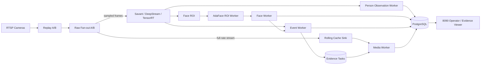

# Video Analytics Platform

A real-time video analytics and event evidence platform for multiple RTSP cameras. It integrates video acquisition, GPU inference, behavior events, face recognition, person trajectories, rolling caches, and evidence generation into an operational, observable, and manageable service architecture.

The core stack includes **Savant / NVIDIA DeepStream / TensorRT, GStreamer, FastAPI, Redis, and PostgreSQL**.

## Core Capabilities

- Multiple RTSP camera inputs, runtime sharding, and A/B analysis branches;
- GPU object detection, pose/behavior rules, and real-time event processing;
- Face ROIs, AdaFace embeddings, person galleries, and watchlist matching;
- Person observations, trajectory queries over time, and event association;
- Full-frame-rate rolling caches and evidence generation around event windows;
- Raw video clips, snapshots, timelines, and evidence metadata such as bounding boxes and poses;
- A Web operator console on port 8090 for camera configuration, runtime control, evidence viewing, person management, and runtime status;
- Task scheduling, fairness across sources, lease recovery, and evidence lifecycle management for multi-camera deployments.

## System Architecture


```mermaid
flowchart LR
    CAM[RTSP Cameras] --> RP[Replay A/B]
    RP --> FAN[Raw Fan-out A/B]

    FAN -->|sampled frames| SAV[Savant / DeepStream / TensorRT]
    FAN -->|full-rate stream| RC[Rolling Cache Sink]

    SAV --> EVT[Event Worker]
    SAV --> OBS[Person Observation Worker]
    SAV --> ROI[Face ROI]
    ROI --> ADA[AdaFace ROI Worker]
    ADA --> FACE[Face Worker]
    FACE --> EVT

    EVT --> TASK[(Evidence Tasks)]
    RC --> MEDIA[Media Worker]
    TASK --> MEDIA

    OBS --> PG[(PostgreSQL)]
    FACE --> PG
    EVT --> PG
    MEDIA --> PG

    PG --> UI[8090 Operator / Evidence Viewer]
```

Full runtime presets use a **rolling-cache-first** evidence pipeline. Real-time inference runs at the configured frame rate, while full-frame-rate encoded streams are retained for later evidence clipping. PostgreSQL persists events, people, rules, and evidence metadata. Redis primarily carries asynchronous messages and stream-based tasks.

## Quick Start

### 1. Prepare the Environment

The target environment is Linux + Docker Compose + NVIDIA GPU Runtime. See the [deployment documentation](docs/midterm_deployment.md) for models, storage directories, and GPU configuration.

### 2. Configure Operator Credentials for Port 8090

The school deployment enables fail-closed Basic Auth on port 8090 by default. Before the first startup, run:

```bash
bash scripts/runtime/set_operator_credentials.sh
```

Credentials are stored at `media/evidence/.operator-auth` under the data directory and are not committed to Git. Missing or invalid credentials cause business, API, media, and evidence routes on port 8090 to deny access, while `/health` reports degraded status.

### 3. Start the School Deployment

```bash
bash scripts/school_deploy.sh
```

This entry point:

1. Rejects deployments with uncommitted source changes while allowing camera/runtime configuration changes normally generated through the 8090 console;
2. Checks operator credentials for port 8090;
3. Starts services through the existing `midterm_start.sh` script;
4. Runs authenticated readiness checks against port 8090 and the internal API proxy;
5. Records the Git commit, Compose configuration summary, image declarations, model hashes, and migration-set hash.

After startup, open:

```text
http://127.0.0.1:8090/operator
```

The browser prompts for operator credentials. Routine use does not require direct access to the internal FastAPI container port.

The current deployment baseline is stored at:

```text
/data/video-analytics/media/evidence/.deployment-baseline.txt
```

It is also available after login at:

```text
http://127.0.0.1:8090/system/deployment-baseline
```

`scripts/midterm_start.sh` remains the underlying deployment script. Use `scripts/school_deploy.sh` for the formal school deployment.

### 4. Configure and Start Video Analysis

1. Register RTSP addresses under **Configuration → Cameras**;
2. Configure camera ROIs, algorithms, and event rules;
3. Select cameras under **Startup and Runtime**;
4. Choose a runtime preset matching the hardware;
5. Start the full pipeline and monitor sources, FPS, queues, and latency on the runtime page;
6. View results on the **Evidence** and **Person Trajectories** pages.

### 5. Check Health and Stop

```bash
bash scripts/midterm_health.sh
bash scripts/runtime/doctor_midterm.sh
bash scripts/midterm_stop.sh
```

## Runtime Presets

The repository provides two main reference presets for a single GPU:

| Preset | Target Streams | Analysis Frame Rate | Branches | Rolling Cache |
| --- | ---: | ---: | --- | ---: |
| `production_t4_40` | 40 | 4 FPS | A/B 20/20 | 600 s |
| `local_4090_60` | 60 | 8 FPS | A/B 30/30 | 600 s |

Exact parameters are defined by `RUNTIME_PROFILE_PRESETS` in `services/api/app/services/runtime_topology.py`. These stream counts are hardware configuration templates; they do not guarantee identical throughput across all bitrates, resolutions, event densities, and camera environments.

## Evidence Generation Pipeline

```text
Event / Watchlist Match
        |
        v
  evidence_tasks (PostgreSQL)
        |
        v
 Media Worker Scheduler
        |
        +--> Rolling Cache segments
        +--> frame annotations / timeline
        |
        v
 raw clip / snapshot / metadata
        |
        v
 PostgreSQL index + 8090 viewer
```

Evidence tasks have explicit waiting, running, completed, failed, and expired states. Media Worker uses scheduling that accounts for source identity and persistent task state to prevent one camera from monopolizing all worker slots. Use `scripts/runtime/report_evidence_camera_ledger.py` to inspect task stages and outcomes by camera.

## Main Directories

| Directory | Description |
| --- | --- |
| `services/` | API, event/media/face workers, rolling cache, Web viewer, and other services |
| `modules/` | Savant / Replay runtime modules and configuration |
| `libs/` | Shared lifecycle, evidence, and runtime components |
| `infra/` | Docker Compose, environment variables, and deployment overrides |
| `db/migrations/` | PostgreSQL schema and migrations |
| `scripts/` | Startup, shutdown, diagnostics, maintenance, and runtime tools |
| `harness/tests/` | Integration, contract, scheduling, and regression tests |
| `docs/` | Architecture, deployment, operations, interfaces, and technical references |

## Key Deployment Files

| Purpose | File |
| --- | --- |
| School deployment entry point | `scripts/school_deploy.sh` |
| Main Compose configuration | `infra/docker-compose.midterm.yml` |
| Default environment variables | `infra/env/midterm.env` |
| Storage mounts | `infra/midterm-storage.override.yml` |
| Dual-branch runtime override | `infra/operator-dual-runtime.override.yml` |
| Savant module | `modules/savant_security/module.yml` |
| Camera runtime snapshot | `modules/savant_security/config/cameras.midterm.yml` |

PostgreSQL is the persistent source of truth for cameras, rules, people, galleries, events, and evidence metadata. Runtime YAML/JSON primarily generates or represents the current runtime configuration. Face vectors use pgvector by default; Qdrant can be enabled through the corresponding profile.

## Documentation

Start with [docs/README.md](docs/README.md).

Common entry points:

- [System architecture](docs/current_architecture.md)
- [Deployment guide](docs/midterm_deployment.md)
- [Web operator guide](docs/midterm_web_operator_guide.md)
- [Operations quick reference](docs/midterm_quick_reference.md)
- [Frontend and API integration](docs/frontend_interface/README.md)
- [Technical reference](docs/midterm_knowledge_base/README.md)

Dated load-test, diagnostic, migration, and design records preserve engineering history. They do not define current deployment interfaces or runtime contracts. Use the stable documents above together with current configuration and source code.

## Deployment Notes

Port 8090 is the unified operator entry point and requires authentication by default in the school deployment. Restrict internal FastAPI, Redis, PostgreSQL, Replay, and metrics ports with host firewalls or network ACLs according to operational needs. Basic Auth provides a minimum access boundary and does not replace TLS, network isolation, or finer-grained role permissions. Enable TLS at the reverse proxy when accessing port 8090 across untrusted networks.
