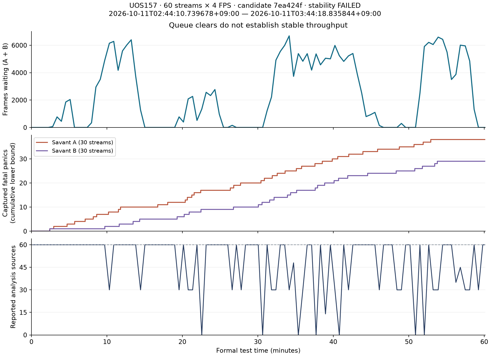

# uos157：分析预算修复 60 路 × 4 FPS × 1 小时实测

日期：2026-10-11，Asia/Seoul（KST，UTC+09:00）。

**总体未通过，不建议将候选版本合入 main 作为已验收版本。** 正式期已产生的 2,589 条应取证视频，2,589 条保存，2,583 条在 180 秒内登记，最长 188.760 秒；留档日志在正式期分别确认至少 38 / 29 次 Rust panic，Docker 累计重启计数达到 43 / 33，2,425 条视频未通过居中校验，抽样完整解码 12 条仅通过 0 条。保存文件不等于证据视频完整可用，保存时效也不能证明崩溃、分析丢帧期间没有漏检。

## 测试版本与工况

- 测试分支：`claude/analysis-budget-20261011`，源码 `7ea424f1b44687355488192647b084137d0696ec`（Opus 的 `d83b872` + `7ea424f`）；本轮未修改候选实现，未合入 main。
- 原生产目录 `/home/user/video-analytics`；隔离测试目录 `/home/user/video-analytics-pressure-analysis-budget-7ea424f`。
- 重建并校验 `analysis-forwarder` 镜像 `video-analytics-midterm-analysis-forwarder:budget-7ea424f`，SHA256 `751a0e6c2639e15428541d0fc1b3408a66089d53600a0892aac5eea852652788`。两分支运行中 `main.py`、`sampler.py`、`queueing.py` 哈希与候选源码一致。
- 正式时间：**2026-10-11T02:44:10.739678+09:00 → 2026-10-11T03:44:18.835844+09:00**，3608.096 秒。排空配置 300 秒。
- Run ID：`pressure60_budget7ea424f_t4_4fps_1h_20261011`。
- 60 路，A/B 各 30 路，单张 Tesla T4；分析目标 4/1 FPS。YOLO26 Pose、YOLO Face、AdaFace ROI 均启用；业务告警为入侵与人脸名单命中，未启用摔倒/聚集/追逐告警。
- `FACE_INFER_INTERVAL=3`、身份刷新 `FACE_IDENTITY_REFRESH_MS=5000`，每路每算法冷却 60 秒；视频前后各 5 秒，人脸名单命中保存图片。materialization WIP=4、MPS=45/45/10、缓存保留 600 秒，延续前次 profile。
- 新启用严格预算、60 秒关键帧欠账上限、分析队列 30 秒年龄上限；原始录制分支不启用年龄淘汰。
- 片源：rr157 `/media/rr/zxlab/qwen27b/1080movie.mp4`；MediaMTX `rtsp://192.168.1.105:8554/live/1080movie`。60 路读取同一直播内容。发布器与前次相同，电影循环起点未对齐，历史对比不是严格单变量实验。
- 无证据清空、无 tmpfs、无数据库清理；Redis RDB/PostgreSQL checkpoint 保持日常配置。沿用 harness 的排空策略：正式负载停止后，证据 worker 的 CPU 绑定扩展到 0–15，尾部事件的完成时间包含该阶段。测试中两次 5 分钟的单路只读元数据订阅增加了少量诊断负载。

## 自动重启的已确认原因

这不是服务器重启，也不是定时任务。Savant 帧处理进程触发原生 Rust panic 后退出，Docker 的 `unless-stopped` 策略将其重新拉起。致命错误为：

```text
thread '<unnamed>' panicked at savant_core_py/src/capi/pipeline.rs:23:29:
Failed to move objects to source-convert, error:
Stage source-convert is out of order.
Stage index 3 < 5, must be greater. Source stage is muxer
fatal runtime error: failed to initiate panic, error 5, aborting
```

| 分支 | 留档日志中的正式期 panic 数（下界） | 最后阶段观测到的累计重启数（含预热/排空） | 最早留档 panic（首尔） |
|---|---:|---:|---|
| A（30 路） | 38 | 43 | 2026-10-11T02:43:47.452950+09:00 |
| B（30 路） | 29 | 33 | 2026-10-11T02:46:37.100752+09:00 |

日志计数合并了异常摘录与中途启动的跟随采集，不是从容器创建开始的完整事件账本；因此将其标为下界，不能把日志条数当成准确总重启数。A 分支首次时间另由首个 panic 的队列审计保留。图中的累计 panic 也只表示留档事件。

实际安装代码中，阶段顺序为 `decode → source-convert → source-capsfilter → muxer`。已处于 muxer 的帧对象再次进入 source-convert 时，Rust 的顺序检查中止进程。错误发生在模型推理之前。运行版本为 Savant 0.6.0 / Savant RS 1.13.0 / DeepStream 7.1；捕获状态没有 OOMKilled。

**触发根因尚未定位。** 现有日志不足以区分重复解码输出/元数据复用、源重连或时间戳状态错误。首个崩溃发生在正式期前、尚未发生过期队列丢帧时，因此不能直接将它归因于 30 秒年龄淘汰。采样改变输入序列仍可能触发已有框架问题，需要隔离对照。主动抽帧本身会产生消息序号跳号，所以 `seq_id` 警告不单独证明网络丢包。

项目已有 Savant v0.6.0 补丁针对 PTS 重置后的 source registry `KeyError`；日志确认补丁加载，但它没有覆盖这次 Rust 阶段错序。不能把本次故障等同于旧补丁已经处理的问题。

Savant 计数器随重启归零，端点差值 FPS 已作废。104 次采样中，最少只有 0 路分析源可见。源 adapter 容器仍然运行不等于全部 60 路一直在分析。

GPU 温度采样范围 None–None°C，功耗上限 None W。温度与功耗记录保留在结果 JSON；这里确认的直接退出原因是原生阶段检查 panic，不能把它写成“GPU 性能不足自动重启”。

## 180 秒与证据质量

| 项目 | 本轮 | 前次人脸刷新 5 秒版本 |
|---|---:|---:|
| 已产生的应取证视频 | 2,589 | 2,804 |
| 已保存 | 2,589 | 2,804 |
| 超过 180 秒 | 6 | 3 |
| 未完成 | 0 | 0 |
| 最长完成耗时（秒） | 188.760 | 208.943 |
| 居中未验证 | 2,425 | 480 |

登记时效判定：**未通过**。起点为事件 `event_ts_ms`，完成点为 `max(evidence_tasks.updated_at, evidence_bundles.updated_at)`，同时检查未 suppressed 应取证事件是否漏建任务。本轮缺失任务 0；P50/P95/P99 = 42.280/104.891/153.697 秒。

文件存在检查：True；全部已保存视频大小与数据库一致：True。抽样完整解码 12 条，通过 0 条。完整文件检查与抽样解码不是对每条视频的事件内容、时间轴和可见性全量验收。

**解码损坏已存在于剪辑之前。** 从原始滚动缓存 source 00 保留的连续三个 `video.mov` 分段，逐段用 FFmpeg `-v error -xerror` 完整解码均失败，包括 `corrupt decoded frame`、invalid level prefix 和宏块错误。诊断副本保存在 `/home/user/analysis-budget-task-artifacts/raw-segment-diagnostics/`。所以不能把损坏全部归因于 media-worker 剪辑或居中校验。停止负载后直接读取 RTSP 15 秒、使用同样源适配器参数抓取约 25 秒则均完整解码通过；这两个较晚的窗口不能证明正式压测期间的源输入一直正常。过载下的源适配器/分发/缓存损失仍需定位。

居中未验证原因：`{"event_not_centered_in_clip": 2425}`。2425 条未验证记录中，2425 条找到了触发帧 UUID。已检查的示例：UUID 对应第 119 帧，summary 投影为 4.963292 秒，而 sidecar 投影为 6.758889、6.448122、5.863711 秒。UUID 找到说明身份锚点存在，不能仅凭它判定所有视频已经正确居中。

人脸正式期观测 30,768 条，覆盖 60 路；人脸图片 1,135/1,135。事件覆盖没有经过带标注的相同片段对照，崩溃和主动丢帧均可能使事件没有被创建，因此整体 180 秒业务验收仍不能签收。

## 采样缓解有没有实际作用

### RTSP 探针与 source-adapter 实际输入必须分开

| 输入窗口 | 旧采样器放行 FPS | 新采样器放行 FPS | 观察 |
|---|---:|---:|---|
| 直接 RTSP 300 秒 | 4.0143 | 4.0043 | 关键帧 2.0005/秒，接近规则 GOP |
| adapter 启动窗口 300 秒 | 4.57665 | 3.98332 | PTS 重置 3 次 |
| adapter 稳态窗口 300 秒 | 4.41625 | 3.94962 | PTS 重置 0 次 |

发布命令显式设置 `-sc_threshold 0`、`-bf 0`、`-g 12`、`-keyint_min 12` 与每 0.5 秒强制关键帧。直接 RTSP 探针 7,205 包、601 个关键帧，间隔 12 帧 593 次、11 帧 7 次。**这不支持“电影镜头切换导致额外关键帧，所以超额 8.1%”的解释。**

实际 adapter 使用 `use_wallclock_as_timestamps=1`。稳态输入 PTS 正向间隔中位数 35.455 ms、P99 493.334 ms，抖动明显；同一序列旧采样器 4.416 FPS，新采样器 3.950 FPS。证据支持“到达时间 PTS 抖动 + 旧关键帧欠账被免除”是超额机制之一，尚不能认定为历史整机差异的唯一原因。

原始源文件含 B 帧，ffprobe 的 packet 顺序不是显示时间顺序。源文件探针中的大量非单调 PTS 不应解释成直播时间戳回退；其按最短正向 PTS 间隔推断的帧率/采样回放也不适合作为实际 RTSP 结论。直播发布器已重新编码为无 B 帧。

### 正式窗口预算、排队与损失

指标窗口 2026-10-11T02:44:21.821847+09:00 → 2026-10-11T03:44:08.511257+09:00，3586.689 秒，240 个 15 秒采样点。

- 每路转发平均 **3.83026 FPS**；接纳量下界 **3.97054 FPS**。接纳量下界 = 转发增量 + 队列增量 + 过期丢弃 + GOP 恢复丢弃 + 发送失败。队列满拒绝/淘汰没有独立计数，不能把下界写成精确总接纳率。
- 原始输入每路平均 16.64526 FPS，低于 RTSP 探针的约 24 FPS；这发生在分析预算前，原始录制链路仍需检查。原始录制分支计数器的丢帧/发送失败为 0/0；这不覆盖 source-adapter 之前可能发生的损失。
- 分析过期丢帧 28,686，GOP 恢复丢帧 1,419，共占接纳下界 3.523%；按 4 FPS 折算 7526.25 路·秒。这是帧数换算，不是实测连续漏检时长。
- Savant 发送失败 83；采样域重置 369。重置指标也包含相同 PTS/新会话，不能直接视为 RTSP 断流次数。
- 15 秒采样队列峰值 7,993，最后 1；队头年龄峰值 29.995 秒。30 秒上限只约束该队列驻留时间，不约束从事件发生到视频登记的全链路耗时。
- Savant 实际处理 FPS 由于频繁重启、采样间计数丢失无法由首尾差值准确求出；结果 JSON 仅保留重置感知的处理量下界。不能把队列回落或转发接近 4 FPS 解释成稳定容量通过。



## 检查、恢复与下一步

部署前在候选归档上运行 39 项相关测试全部通过，包含密集关键帧欠账、UUID-only 关键帧、过期队列及探针测试；原复核的独立 burst 输入回放降到 4.0 FPS，UUID-only 关键帧恢复用例通过。`git diff --check` 与 `operator.js` 语法检查通过。单元测试没有覆盖这次原生解码/帧元数据错序崩溃。

正式时段保持代码和测试参数不变；结束后完成排空、独立数据库/文件验收与恢复。恢复核验时间：**2026-10-11T04:21:10.579986+09:00**。日常容器的原镜像、环境、挂载、命令、CPU 绑定和启停状态已恢复；PostgreSQL/Redis 容器身份保留，既有摄像头记录一致，测试摄像头已禁用，测试源已停止，分析容器恢复为测试前的停止状态，GPU 计算进程为 0。服务器未关机，历史及新测试证据保留。

首次自动恢复遇到 Docker 同名容器创建 409 冲突，原始 supervisor 失败状态保留。等异步恢复动作结束后重新运行恢复脚本，修复残留 video-file-sink 配置与生成配置，再通过独立核验；不能仅凭 helper 退出认定恢复成功。

建议下一步先用固定片段和少量路数复现 Rust 阶段错序：记录解码前后 source ID、frame UUID、原生帧索引及 PTS/DTS，判断帧对象在哪个环节被重复使用；在同一输入上对比 strict budget 开关，定位新增触发条件。不要通过关闭 Docker 自动重启或吞掉阶段错误来宣称修好。另行检查原始帧率和 summary/sidecar 时间轴的分歧，完成事件内容与居中验收，再进行完整 60 路一小时复测。

新报告提交与推送记录使用 Asia/Seoul。保留 Opus 已发表提交的原时区和事件原始时间；提交时间不等同于 GitHub 收到推送的时间。完整结构化结果见 [`pressure60_analysis_budget_uos157_1h_2026-10-11.results.json`](./pressure60_analysis_budget_uos157_1h_2026-10-11.results.json)。
