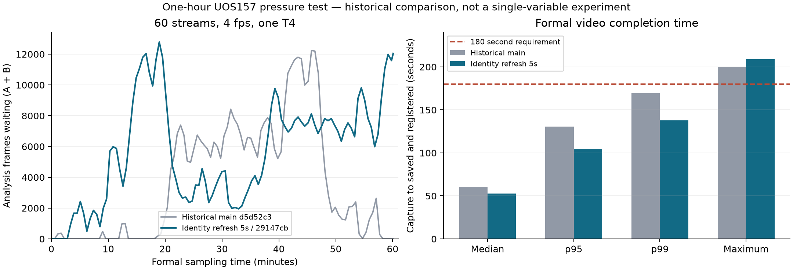

# uos157：人脸身份刷新缓解后的 60 路 4 FPS 一小时复测

日期：2026-10-11，Asia/Seoul（KST，UTC+09:00）。源码部署、正式负载、独立验收、harness 检查与更新后日常配置恢复均已完成。

**“每条应取证视频在 180 秒内保存并登记”的要求仍未通过：正式期 2,804 条视频全部保存，其中 2,801 条在 180 秒内完成，3 条超时，最长 208.943 秒。正式采样结束时分析队列仍有 12,050 帧。**

## 代码、部署与时间

- GitHub main / 实机测试源码：`29147cb721a0f9ab357c52c15b3c7e84cc6cf4f4`。
- 人脸身份刷新实施提交：`8d9e900be6dcf8ee0162fa339a2ebd49f729e877`。
- 生产目录：`/home/user/video-analytics`；测试隔离目录：`/home/user/video-analytics-pressure-face-refresh-29147cb`。
- 部署开始/完成：2026-10-10T23:33:05.568100+09:00 / 2026-10-10T23:33:42.964736+09:00。
- 正式采样：**2026-10-10T23:42:18.638363+09:00 → 2026-10-11T00:42:29.250495+09:00**，实际 3610.612 秒，配置 3,600 秒，105 次采样，始终 60 路在线。
- Run ID：`pressure60_face_refresh5s_t4_4fps_5s5s_1h_20261010`。
- 原发布提交 `29147cb` 的 author/committer 日期为 `2026-10-10T14:03:51Z`，等价于首尔 `2026-10-10T23:03:51+09:00`；保留已发布历史。

本报告展示、部署记录以及新报告提交/推送均使用首尔时间。结果 JSON 中保留原始采样和事件时间戳，并提供首尔时间转换；不改服务器时钟或历史证据时间。Git 提交时间与推送开始/完成时间分别记录。

## 测试工况与缓解方式

60 路分成 A/B 两支各 30 路，共用一张 Tesla T4 GPU 0。主分析配置 4/1 FPS，最低门槛 99/25 FPS。启用的业务告警为**区域入侵与人脸名单命中两项**；YOLO26 Pose、YOLOv8 Face 和 AdaFace ROI 均运行。摔倒、聚集、追逐代码已部署，这次对照没有启用这三项业务告警。

本次修改降低的是 **AdaFace 身份识别刷新频率**，不是把人脸检测关闭或改成每 5 秒检测一次。YOLO Face 的 `FACE_INFER_INTERVAL=3` 保持原值。首次可用人脸立即识别；同一 track 后续默认间隔 `FACE_IDENTITY_REFRESH_MS=5000`，清晰度门槛为 64 px / confidence 0.60 / yaw ratio 0.35。ROI 路径日志验证策略位于 AdaFace 之前，存在 first_sighting、refresh、clear_upgrade 和 refresh_wait 等实际计数。

其余使用前次一小时 T4 profile：Pose/Face batch=4/4，AdaFace ROI batch=16、timeout=200 ms；WIP=4、remux=1、finalizer=4、process=4、segment I/O=2；MPS=45/45/10；滚动缓存保留 600 秒，保持原 NVMe 挂载，drain=300 秒。Redis RDB 与 PostgreSQL checkpoint 保持日常设置；没有使用 tmpfs 或删除既有证据。

每路、每业务算法冷却 60 秒。入侵保存前后各 5 秒的视频，人脸名单命中保存图片。180 秒是独立业务验收线，worker 现有 300 秒 deadline 未改。

片源经 rr157 和 uos157 双向核实：rr157 `/media/rr/zxlab/qwen27b/1080movie.mp4`，MediaMTX `rtsp://192.168.1.105:8554/live/1080movie`，H.264 / 1920×1080 / 24000/1001 FPS。现有 FFmpeg 发布为 libx264 ultrafast、baseline level 3.1、bf=0、g=12 / keyint_min=12、每 0.5 秒强制关键帧、2 Mbps、zerolatency、循环播放；未修改发布器。60 路读取同一实时画面，属于同步事件压力场景，不能当作 60 个独立内容的摄像头。

## 正式期产出与 180 秒验收

起点采用 `events.event_ts_ms`，完成点采用 `max(evidence_tasks.updated_at, evidence_bundles.updated_at)`，覆盖文件保存与数据库登记。只统计正式帧时间窗口内未 suppressed、应取证的事件。

| 指标 | 结果 |
|---|---:|
| 入侵应取证事件 / 取证任务 / 已保存视频 | 2,804 / 2,804 / 2,804 |
| 缺失任务 / 未完成视频 | 0 / 0 |
| ≤180 秒 | **2,801（99.893%）** |
| >180 秒 | **3（0.107%）** |
| p50 / p95 / p99 | 52.596 / 104.772 / 137.931 s |
| 最长保存登记 | **208.943 s** |
| 人脸名单图片：应保存 / image_ready | 1,363 / 1,363，覆盖 60 路 |
| AdaFace 特征观测 | 41,022，覆盖 60 路 |
| generated_unverified 视频 | 480 |

全部 2,804 个视频文件存在，文件大小与数据库一致。抽查正常、未验证、最慢和末尾视频共 12 个，FFmpeg 整片解码全部通过。完整解码抽查不代表全量视觉内容审核或全量居中校验通过。

3 条超时全部集中于测试源后缀 `_15`，事件帧在采样末段。两段耗时分别列出，不能把总时长全部解释为剪辑速度。

| Event ID | 源后缀 | 事件帧时间（KST） | 帧 → 事件入库 s | 入库 → 保存登记 s | 总耗时 s |
|---|---:|---|---:|---:|---:|
| `c4da481a-ab84-4b42-91fb-622d6e9d6d29` | 15 | 10-11 00:39:22.754 | 72.765 | 136.178 | **208.943** |
| `395b7fc5-4096-4a4e-b81d-65fc02bb6f66` | 15 | 10-11 00:40:34.735 | 85.699 | 122.144 | **207.843** |
| `a936bcd0-ceec-4532-b0fd-8a5995061d2c` | 15 | 10-11 00:41:43.638 | 84.062 | 101.389 | **185.450** |

现有证据说明分析前段与取证阶段都有等待，并且超时集中在同一路。尚未取得足够的逐任务调度证据来断定该路集中超时的具体原因。最慢一条为 72.765 秒 + 136.178 秒 = 208.943 秒。

## 冷却、吞吐与分析积压

按正式任务的 source + event_type 检查相邻事件帧时间：入侵最短 60.000 秒，名单命中最短 60.353 秒，两类均没有小于 60 秒的间隔。模型持续检测，冷却限制重复告警与取证；积压是在冷却已经生效的条件下发生的。

| 指标 | 结果 |
|---|---:|
| 首末 Savant 计数差 / 实际观测时间 / 路 | 4.309287 FPS |
| 最低单路同口径 FPS | 4.181911 |
| 低于 3.96 FPS 的路数 | 0 |
| Forwarder 发送计数差 / 路 | 4.323295 FPS |
| 确认聚合队列峰值 | 12,786 帧 |
| 瞬时聚合队列峰值 | 13,183 帧 |
| 初始 / 最后正式采样队列 | 0 / **12,050 帧** |
| 非零队列采样 / 全部采样 | 99 / 105 |
| 确认聚合队列 ≥2,048 的采样 | 86 |
| 瞬时聚合队列 ≥2,048 的采样（harness） | 90 |
| Savant 发送失败计数增量 | 4 |
| 原始录制转发丢帧 / 发送失败 | 0 / 0 |

队列是 A/B 两支合计。实际平均处理帧率超过名义 4 FPS，因为当前 sampler 保留关键帧，4 FPS 不是严格输入上限。这是与历史运行比较时的实际负载差异。Forwarder 的发送计数只表示已发送帧，不能当成全部进入队列的帧；队列末端残量是独立事实。整小时平均 FPS 达标不能替代逐条 180 秒验收，也不能证明短时间窗口内始终达标或积压已收敛。

本轮 GPU 温度 55–62°C，功耗限制 70 W；实机 performance 查询显示 SW Power Cap active，HW/SW Thermal Slowdown 未激活。没有证据把本轮归因为热降频，也不能仅凭功耗限制断定超时的完整原因。ROI 裁剪错误、编码错误和队列丢弃监控均为 0。

## 居中“未验证”的诊断

480 个 `generated_unverified` 全部记录 `event_not_centered_in_clip`。逐条读取数据库帧时间线，**480/480 个告警 UUID 找到对应帧**。

样本告警帧索引为 119，最终 summary 的位置为 4.963292 秒，而 sidecar 投影出现 4.095378、4.189944 等值。它们构成两个计算结果不一致的证据；没有把 UUID 存在解释为全部视频视觉居中，也没有改原始质量失败状态。保存超时和居中质量判断分别验收；其中一条超时视频同时属于未验证状态。

## Harness 最终检查

- 最终状态：`failed_pressure_gates`，helper 退出码：1。
- 失败项：`["savant_send_failures", "forwarder_queue_full", "forwarder_queue_nonzero", "validate_seq_iq_exceeded"]`。
- 警告：`["tensorrt_engine_mps_partition_warning"]`。

| 全量检查范围（包含收尾） | 结果 |
|---|---|
| 视频时长 / 原始帧率 | 2,864/2,864 通过；5+5 秒，时长容差 1.25 秒，最低原始 FPS 20 |
| 8090 详情 | 4,227/4,227 可读取 |
| 视频数据库时间线 | 2,864/2,864；缺失 0，文件系统回退 0 |
| 视频数据库叠框 | 2,864/2,864；回退、bbox 缺失和人物上下文缺失均为 0 |
| 人脸图片叠框 | 1,363 条按“预期叠框为零”的图片策略跳过 |
| 滚动缓存全帧率 | full_rate_ok=true，10,346 个已测量 segment，覆盖 60 路 |
| 人物轨迹持久化 | passed；采样末次 consumer lag/pending=0/1 |

有 9 条视频的接口叠框行数少于文件/summary 预期，harness 归因记录为 `db_overlay_rows_can_merge_clip_frame_index`，未列为接口失败。不能据此声称每条叠框的行数完全一致。人物轨迹的 lag/pending 是最后正式采样值，不是恢复完成后的测量。

全量视频时长/原始帧率检查、8090 详情/时间线/叠框和人物轨迹持久化的原始结果保存在结果 JSON 的 `harness_*` 字段。harness 会包含正式窗口之后的 postfill/收尾产物；其数量不替代正式期的 2,804 条视频口径。`forwarder_queue_full` 等名称需结合实际指标理解：聚合队列 ≥2,048 不等于两个各 8,192 容量的分支均已装满；`validate_seq_iq` 日志在主动采样时可能包含序号跳跃，不直接作为缺失证据数。

## 与前一轮一小时结果的历史对照

基线为 [d5d52c3 一小时报告](pressure60_main_uos157_1h_2026-10-10.md)。使用同一 T4 profile、片源、冷却和证据策略；测试发生于不同直播相位，且 main 含其他变更、实际分析帧率也不同，因此这是历史工况对照，不是只改变一个变量的实验。

| 指标 | 历史 d5d52c3 | 本次 29147cb |
|---|---:|---:|
| 正式视频 | 2,766 | 2,804 |
| >180 秒视频 | 10 | 3 |
| p50 s | 60.024 | 52.596 |
| p95 s | 130.544 | 104.772 |
| p99 s | 169.354 | 137.931 |
| 最长保存登记 s | 199.660 | 208.943 |
| 人脸特征观测 | 145,299 | 41,022 |
| 人脸名单图片 | 1,359 | 1,363 |
| 确认队列峰值 / 末值 | 12,240 / 0 | 12,786 / 12,050 |
| 每路平均处理 FPS | 4.0778 | 4.3093 |
| generated_unverified | 31 | 480 |

身份观测减少约 71.77%，名单图片数量接近，视频 p50/p95/p99 下降、超时数量减少；同时最慢保存时长更高、采样末端队列没有归零、质量未验证数量增加。本轮没有标注召回率，不能据图片数量接近推断身份识别召回未变。

## 更新后日常部署恢复与资料

容器恢复完成：2026-10-11T01:21:46.733477+09:00；全部配置最终核验完成：**2026-10-11T01:29:10.017979+09:00**。对照“已更新至 29147cb、尚未开始压测”的原容器快照，环境、挂载、镜像、命令、CPU 绑定和运行/停止状态均核实。harness 与精确恢复会重建服务，因此部分原容器 ID 已变化，具体名单保存在恢复核验 JSON；PostgreSQL 与 Redis 两个数据服务容器 ID 保持。非 Compose video-file-sink 另按 Docker Engine 快照恢复。恢复保留本次人脸刷新代码和参数，没有回滚到 d5d52c3。

最后核验发现 harness 复用了前次 60 个已停用测试摄像头 ID，结束时没有恢复 source_id。已于 2026-10-11T01:27:37.916801+09:00 仅恢复这 60 条摄像头的 source_id 和原生成接入配置；本轮 events、evidence_tasks、evidence_bundles 未修改，全部证据保留。恢复后的 61 条原摄像头配置与测试前快照完全一致。

最终核验包括 8090 健康、摄像头/runtime 配置与测试前一致、60 路压测源已停止且没有测试推理残留。测试产物与既有证据保留，服务器未关机。

- [可分享结果 JSON](pressure60_face_refresh_uos157_1h_2026-10-11.results.json)：独立统计、480 条 UUID 诊断、12 个完整解码结果、harness 汇总、部署与恢复记录，未包含连接凭证和完整私密容器环境。
- 实机完整产物：`/data/video-analytics/artifacts/pressure60_face_refresh5s_t4_4fps_5s5s_1h_20261010`。
- 部署备份：`/home/user/video-analytics-deployment-backups/20261010T233305+0900-face-refresh-29147cb`。
- 本地相关测试此前为 268 passed / 5 failed，5 个失败均来自本机缺少 Docker 二进制的压测 harness 测试；新身份策略与拓扑测试通过。本次实机压力和业务门槛结果如上，不称全部检查通过。

建议后续先查三条超时所在的 `_15` 路调度等待，严格控制实际分析采样预算，并修正 sidecar 与最终 UUID 投影的校验顺序。当前缓解有效降低重复身份推理，仍不足以保证所有视频在 180 秒内保存。
