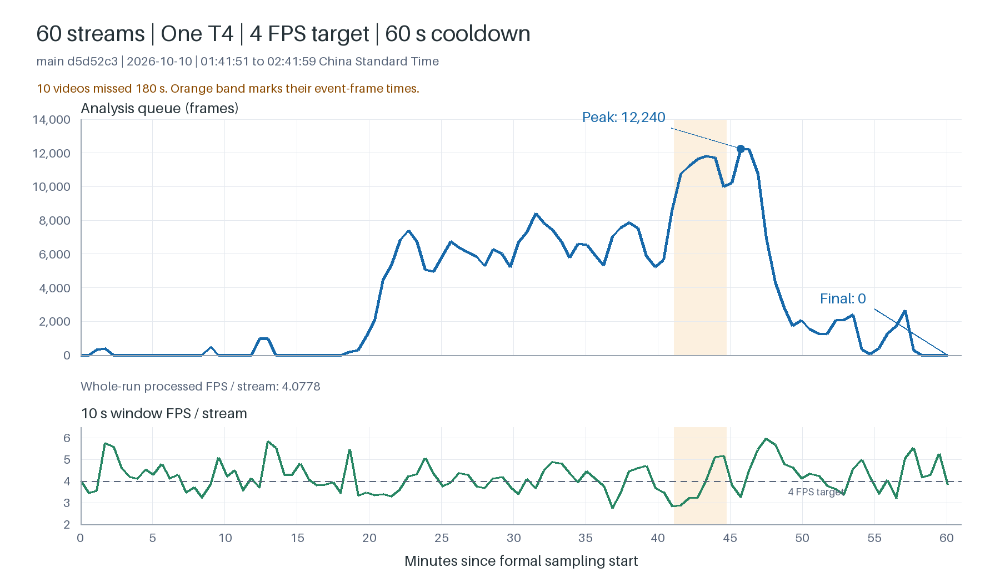

# uos157：60 路 4 FPS 一小时复测

日期：2026-10-10，Asia/Shanghai。状态：负载、证据核查与部署恢复全部完成。

本报告保留原始测试的 Asia/Shanghai（UTC+8）时间；结果 JSON 内的 UTC/+08:00
时间戳也保留原值。本次同步的 Git 提交、推送记录统一使用韩国首尔
Asia/Seoul（UTC+9），不是把历史测试时间重新设定。
正式采样窗口换算为首尔时间是 2026-10-10 02:41:51.932–03:41:59.877。
前一轮短测见 [60 路 4 FPS 短测报告](pressure60_main_uos157_2026-10-10.md)。

用户明确要求观察一小时后分析积压，而不是仅凭十分钟结果推断。
业务要求是每条应取证的视频从对应事件帧时间开始，在 180 秒内完整保存并登记。

## 基线与参数

- GitHub main：`d5d52c350eefbcfca20e7b96d679da4be2764994`。
- 本地分支：`CZray/pressure60-main-20261010`。
- 独立实机源码：`/home/user/video-analytics-pressure-main-d5d52c3`。
- Run ID：`pressure60_main_t4_4fps_5s5s_1h_20261010`。
- 主机：uos157，单张 Tesla T4，16 CPU 线程，约 30 GiB 内存。
- 60 路，A/B 30+30 共用 GPU 0，主分析目标 4 FPS。
- 每路启用区域入侵和人脸名单识别。人体/姿态、人脸检测和 AdaFace 特征链路运行。
- 每路、每算法告警 cooldown=60 秒；模型持续检测，重复告警与取证受冷却限制。
- 入侵保存 5+5 秒视频；人脸名单命中保存图片。不是全部业务算法同时启用、
  也不是所有类型告警均保存视频的测试。
- main T4 profile：WIP=4、remux=1、finalizer=4、segment-index I/O=2、MPS=45/45/10。
- 正式采样 3,600 秒，配置 drain=300 秒；缓存保留 600 秒。
- 仍使用 rr157 MediaMTX 的 `rtsp://192.168.1.105:8554/live/1080movie`。
  60 路同一直播时刻，作为同步输入压力场景。
- 保留 Redis RDB 和 PostgreSQL checkpoint 日常设置，不使用 tmpfs，不清理旧证据。

## 启动核验

测试前再次保存容器快照。压测脚本不会自动重建所有后台服务，因此正式采样前
将 API、person-observation-worker 和 face-worker 统一重建为 main 目录挂载。
后台切换完成时间早于正式采样开始。API/event/person/face/clip/media 和两个
rolling sinks 已 inspect 核实，缓存持续使用：

```text
/home/user/video-analytics-fast/rolling-cache
/home/user/video-analytics-fast/rolling-cache-materialized
```

正式采样从北京时间 2026-10-10 01:41:51.932899 开始，60/60 路在线。
正式采样在 02:41:59.877 结束；取证收尾、完整媒体校验和原部署恢复不计入采样时长。

## 结果

正式负载、harness 媒体/API 校验和原部署恢复均已完成。

**业务时限未通过：2,766 条视频全部保存，2,756 条在 180 秒内登记，10 条超时，
最慢 199.660 秒。** 本轮分析队列期间升到 12,240 帧，又在仍有输入时回落，
最后采样为 0；这说明积压会波动并造成延迟，不能据此断言无限增长。



橙色区间标记 10 条超时视频的事件帧时间，不是视频完成时间。

### 正式时间与产出

- 正式采样：北京时间 01:41:51.932–02:41:59.877，共 3,607.945 秒。
- 104 次采样，FPS 首末计数观测间隔 3,602.820 秒。
- 2,766 条入侵视频全部完成登记：02:42:17.379，从采样开始约 60 分 25 秒。
- 1,359 条名单图片全部完成：02:38:48.601。
- 预热、postfill、取证收尾、媒体校验与恢复不计入正式采样。

每路有两种业务算法。YOLO26 Pose、YOLOv8 Face、AdaFace 三个底层模型运行，
face_infer_interval=3，不能理解为三个模型均每路每帧运行。
Pose/Face batch=4/4，AdaFace batch=16、timeout=200 ms；
每 sink 一个 publication worker，split/fsync。
worker 现有任务 deadline 仍为 300 秒，180 秒是独立逐条验收，未修改运行 deadline。
rr157 原电影约 44 分 03 秒，60 路共享实时画面；启动错开 0.53 秒不是独立电影时间轴。

### 冷却间隔验证

模型持续分析，cooldown 限制同一路、同算法的重复告警及取证。
按正式期任务的 source + event_type 计算相邻事件帧间隔：

| 业务算法 | 任务数 | 覆盖路数 | 最短间隔 | 中位间隔 | 小于 60 秒 |
|---|---:|---:|---:|---:|---:|
| 区域入侵 | 2,766 | 60 | 60.001 s | 66.557 s | 0 |
| 人脸名单命中 | 1,359 | 60 | 60.764 s | 111.901 s | 0 |

因此积压和超时是在冷却 60 秒生效的条件下发生的。

正式期还记录了 7,238 次重复入侵和 671 次重复名单命中，均因
camera_algorithm_cooldown 被 suppressed，没有创建取证任务。
未被冷却过滤的事件与取证任务、证据 bundle 数量逐一一致：2,766 个视频、1,359 个图片。
“全部取证任务完成”采用该冷却策略下的应取证集合，不包含 suppressed 重复事件。

### 分析队列与吞吐

| 指标 | 结果 |
|---|---:|
| 每路 FPS，Savant 首末计数差 / 实际时间 | **4.0778** |
| 每路 FPS，forwarder 首末发送计数差 / 实际时间 | 4.0797 |
| 确认聚合队列峰值 | **12,240 帧** |
| 瞬时聚合队列峰值 | 12,686 帧 |
| 最后一次正式采样队列 | **0 帧** |
| Savant 分析侧发送失败计数增量 | 9 |
| 原始录制转发丢帧 / 发送失败 | 0 / 0 |

停流前 60/60 接入容器运行，退出/重启均为 0，负 PTS 报错及零帧接入均为 0。
分析侧 9 次发送失败与原始录制转发的 0 次失败属于不同链路，不能合并解释为零失败，
也不能直接等同于 9 个缺失的视频证据。

队列为 A/B 两分支合计。采样器放行关键帧，实际输入可能略高于名义 4 FPS。

| 时间段 | 确认队列峰值 | 时间段末队列 | Savant 计数 FPS / 路 |
|---|---:|---:|---:|
| 0–5 分钟 | 375 | 0 | 4.2454 |
| 5–10 分钟 | 480 | 0 | 4.1006 |
| 10–15 分钟 | 984 | 0 | 4.1282 |
| 15–20 分钟 | 1,117 | 1,117 | 3.8312 |
| 20–25 分钟 | 7,390 | 4,974 | 3.9181 |
| 25–30 分钟 | 6,746 | 5,228 | 4.1766 |
| 30–35 分钟 | 8,427 | 6,594 | 4.2464 |
| 35–40 分钟 | 7,872 | 5,217 | 4.0857 |
| 40–45 分钟 | 11,806 | 9,993 | 3.4537 |
| 45–50 分钟 | 12,240 | 2,056 | 4.5982 |
| 50–55 分钟 | 2,402 | 33 | 4.1754 |
| 55–60 分钟 | 2,636 | 0 | 4.2807 |

每行使用时间段内首末观测计数差，观测之间有间隔，不是所有帧精确按整五分钟分箱。
跨过 60 分钟的最后一个采样队列也为 0。前 15 分钟基本无队列，第 20 分钟后升高，
第 40–47 分钟达到高点，第 49 分钟以后回落。回落发生在 60 路输入仍运行时。
终点为零不能抹掉期间延迟，平均 FPS 达标也不能替代逐条保存时限验收。

GPU 温度负载期约 58–62°C，观察到 SW Power Cap active，
配置/默认/最大功耗限制均为 70 W；未观察到 thermal slowdown。
不能仅凭这些观测把超时直接归因于 GPU 降频。

脚本最终状态为 failed_pressure_gates，退出码 1。计数 FPS 达到 3.96 最低门槛，
失败项为 savant_send_failures、forwarder_queue_full、forwarder_queue_nonzero、
validate_seq_iq_exceeded；警告为 tensorrt_engine_mps_partition_warning。

forwarder_queue_nonzero 检查的是期间最大值，不是结束残量。
forwarder_queue_full 来自 55 次瞬时聚合队列 >=2,048 的采样，不能据此断言
两个 8,192 容量的分支都已装满。Savant 的 validate_seq_iq 日志共 879,239 条，
从约 24 FPS 主动采样到 4 FPS 会产生序号跳跃，不能把这个日志数量当作丢帧数。
用户的 180 秒业务要求另按逐条保存登记时间验收。

### 180 秒业务时限

起点为事件帧时间 events.event_ts_ms；完成点取 bundle 和 task 最后更新时间中较晚者，
覆盖保存和数据库登记。正式期按事件帧窗口筛选，全部视频时间字段有效。

| 正式期入侵视频 | 数量 / 耗时 |
|---|---:|
| 应取证 / 已保存登记 | 2,766 / 2,766 |
| <=180 秒完成 | **2,756（99.638%）** |
| >180 秒完成 | **10（0.362%）** |
| 未完成 / 失败 | 0 / 0 |
| p50 / p95 / p99 | 60.024 / 130.544 / 169.354 s |
| 最慢保存登记 | **199.660 s** |
| worker 完成最慢 | 198.958 s |
| 质量待验证 | 31，另行判断 |

p99 低于 180 秒，仍不能通过“每条都不超过 180 秒”的要求。

10 条超时视频的 media_status 均为 materialized，与 31 条 generated_unverified 没有交集。
保存延迟与事件居中校验偏差是两项分别定位的问题。

10 条超时分布于 6 路，事件帧集中在约 02:22:59–02:26:37，
保存登记为 02:26:05–02:29:49。事件帧到入库约 74.9–89.9 秒，
入库到最终保存约 97.4–119.4 秒，两段等待叠加。
最慢一条约 82.509 秒 + 117.151 秒 = 199.660 秒。

全量事件帧到入库 p95=75.450 秒、最大=94.588 秒；
入库到保存登记 p95=84.749 秒、最大=132.272 秒；
worker finalization p95=1.265 秒。最终生成阶段不是百秒耗时主体。
worker queue_wait_ms 从事件入库计时并包含前置等待，
不能当作全部分析延迟或纯线程池排队时间。

缓存 publication queue residence 的 A/B 分支 p95 为 50.167/54.070 ms，
最大 8.641/8.559 s；dispatch 总耗时 p95 为 70.221/73.424 ms。
它们包含收尾日志，并非超时那 10 条事件的逐条因果测量。
本轮没有复现最初错误挂载试跑的百秒发布积压，不能用无效试跑给本轮归因。

### 居中待验证：UUID 与 sidecar 计算不一致

31 个 generated_unverified bundle 均只有 event_not_centered_in_clip 这一质量失败原因，
对应事件集中在约 0.653 秒内。对全部 31 条读取数据库帧时间线：

- 告警 frame_uuid 全部存在，均位于 clip_frame_index=119。
- 该帧 PTS 与 time_window.event_frame_pts 全部相同。
- 最终 summary 的事件位置均为 **4.963292 秒**，接近期望第 5 秒。
- sidecar summary 的事件位置为 **5.763467–6.272611 秒**，因此触发居中失败。

这构成锚定/投影计算不一致的直接证据，不能把状态解释为告警帧不存在。
下一步应追踪 sidecar 投影值与最终 UUID 重定位值的更新和校验顺序，再补测试修复。
本轮保留原质量状态，没有跳过居中校验。

### 媒体校验与恢复

独立抽查 12 个完整视频，包含每个质量状态首批、最慢三条及最后三条正式期视频，
FFmpeg 全帧解码全部通过。其中 3 条是 generated_unverified。
解码成功不能替代居中校验或全量视觉内容审核。

harness 全量校验已完成：

| 范围 | 结果 |
|---|---|
| 视频时长/帧率 | 含收尾 2,826/2,826 通过；5+5 秒，时长容差 1.25 秒、最低原始 FPS 20 |
| 全部详情 | 4,185/4,185 可读取，含 60 个收尾视频 |
| 视频数据库时间线 | 2,826/2,826，无缺失、无文件系统回退 |
| 视频数据库叠框 | 2,826/2,826，无 bbox/人物上下文缺失，无文件系统回退 |
| 图片叠框检查 | 1,359 个图片按策略跳过“预期叠框为零”检查 |
| 人物轨迹持久化 | passed，消费者 final lag/pending=0/0 |
| 正式期 AdaFace 特征观测 | 145,299 条，覆盖全部 60 路 |

3 条视频接口叠框行数分别为 28/29、35/36、36/37，
harness 归因记录为 db_overlay_rows_can_merge_clip_frame_index，未列为接口失败。
此结果不是独立证明每一条叠框的数量完全一致。

精确恢复对照测试前 28 个原容器快照，配置和运行/停止状态核对无差异：
原有 14 个后台容器运行，原本停止的接入/推理保持停止；测试源/helper 无运行残留，
GPU 无计算进程。PostgreSQL/Redis 容器身份不变，原源码与全部证据保留。
最终 8090 的 /api/v1/runtime/overview 返回 HTTP 200。

原非 Compose video-file-sink 曾被 harness 修改运行 epoch 环境变量，已按原 Docker
快照重建恢复；测试改动容器保留为停止的 pressure1h-rollback-backup，未删除。
启动时已添加的 migration 031/033 保留，为附加结构，没有删除旧业务数据。

### 独立结果文件

实机另保存 independent_analysis_trend.json、independent_cooldown_check.json、
independent_deadline_metrics.json、independent_formal_metrics.json、
independent_formal_times.json、independent_unverified_uuid_check.json、
independent_decode_check.json、independent_formal_event_outcomes.json。
可分享汇总已保存为 [结果 JSON](pressure60_main_uos157_1h_2026-10-10.results.json)，
去除了数据库连接串和原容器私密环境配置。


完整实机产物：

```text
/data/video-analytics/artifacts/pressure60_main_t4_4fps_5s5s_1h_20261010
```

日志：

```text
/home/user/video-analytics-pressure-main-d5d52c3/pressure-state/onehour.log
```
